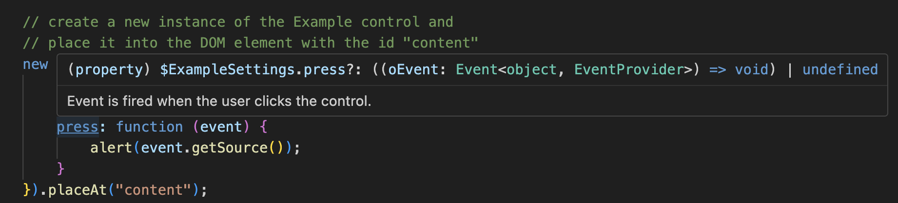

# End-to-End Sample for UI5 Library Development and `dts-generator` Usage

This mini tutorial demonstrates how to use the dts-generator. It starts from scratch with creating a new UI5 library, so the entire end-to-end flow is covered. For an existing library, you can start with step 2.

## Step 0: Get Prepared

Have a recent [Node.js](https://nodejs.org/de/download) version (recommended: 18.x or 20.x) installed on your machine.

Install [Yeoman](https://yeoman.io/) and the [Easy UI5 Generator](https://github.com/SAP/generator-easy-ui5) globally by entering the following command in your console:

```sh
npm install -g yo generator-easy-ui5
```

## Step 1: Create a JavaScript UI5 Library

> NOTE: The dts-generator creates type definitions for libraries _implemented in JavaScript_, so it is not needed for libraries which are already implemented in TypeScript!

Create a new JavaScript UI5 library:

```sh
yo easy-ui5 library
```

In the wizard, choose suitable options - or leave everything on default for just trying the end-to-end flow:

```
dtsgen-end-to-end % yo easy-ui5 library

     _-----_
    |       |    ╭──────────────────────────╮
    |--(o)--|    │  Welcome to the easy-ui5 │
   `---------´   │     3.8.1 generator!     │
    ( _´U`_ )    ╰──────────────────────────╯
    /___A___\   /
     |  ~  |
   __'.___.'__
 ´   `  |° ´ Y `


? What is the namespace of your library? com.myorg.mylib
? Which framework do you want to use? OpenUI5
? Which framework version do you want to use? 1.123.0
? Would you like to omit the namespace in the src and test folder? Yes
? Who is the author of the application? UI5 Team
? Would you like to create a new directory for the application? Yes
? Would you like to initialize a local github repository for the application? Yes
```

The library code is then generated and the dependencies are installed. In case of issues, make sure you have a recent version of `easy-ui5` installed. Or, if the dependency installation fails, change into the library directory and re-try `npm install`.

## Step 2: Build the Library API Info

Change into the root directory of the library and execute the UI5 build with "jsdoc" argument:

```sh
cd com.myorg.mylib
npx ui5 build jsdoc
```

If you have the UI5 build tools installed globally, you can instead simply say `ui5 build jsdoc`. If you haven't, `npx` uses the UI5 tooling from the library dependencies.

When the build has completed, the `api.json` file is at `dist/test-resources/com/myorg/mylib/designtime/api.json` (do not confuse this file with the `api.json` file one folder below inside `apiref` - that one is meant for the UI5 SDK).

This file is the API description used not only for the type generation, but also for the API documentation in the UI5 SDK.

**NOTE:** To get proper content, you must maintain the JSDoc in the JavaScript sources correctly. This is not always trivial. You can find instructions at https://github.com/SAP/openui5/blob/master/docs/guidelines/jsdoc.md and in sibling files.

The TypeScript type definitions only contain the public API of the library, so entities which are not marked as public will not be available.

## Step 3: Get Required Dependencies

### 3.1 The dts-generator

First of all, of course you need the dts-generator, so install it as dev dependency:

```sh
npm install --save-dev @ui5/dts-generator
```

> NOTE: make sure to use at least version 3.1.0 of the dts-generator.

### 3.2 The `api.json` Files of Libraries You Depend on

Some types in your library depend on UI5 base classes, e.g. controls inherit from `sap.ui.core.Control`. And there may be other such dependencies, like when a type from sap.ui.core or other libraries is used in your APIs.

For generating the type definitions properly, you need to make the `api.json` files for these dependencies (and transitively for their dependencies) available to the dts-generator. These files are currently only available from UI5 deployments like the UI5 CDN.

The dts-generator comes with a tool to download these files for a list of libraries and a given version. It is invoked like this:

```sh
npx ui5-download-apijson sap.ui.core 1.123.0 --targetDir ./temp/dependency-apijson
```

After running it, in the directory `./temp/dependency-apijson` there should be the file `sap.ui.core.api.json`.

> NOTE: you can choose a different target folder, just make sure it is either non-existing or contains only \*api.json files (they will be deleted) and you use the same path below when generating the type definitions.

> NOTE: Not providing the api.json files of the dependency libraries below when you generate your type definitions will not make the generation fail, but will cause a type fallback of those unknown types. `any` or `Object` wil lbe used instead of those base classes, leading to much less type safety. The resulting code would include lines like:
>
> - `export default class Example extends /* was: sap.ui.core.Control */ Object { ...`
> - `static getMetadata(): /* was: sap.ui.core.ElementMetadata */ any;`
> - `fnFunction: (p1: /* was: sap.ui.base.Event */ any) => void,`

### 3.3 The OpenUI5 Type Definitions

By default, the generation of the type definitions includes a test compilation using the TypeScript compiler. For this, also the `*.d.ts` files for the library dependencies need to be available because your library normally depends on those base classes. So add also them as dev dependencies:

```sh
npm install --save-dev @types/openui5
```

> Make sure that the UI5 types (at least roughly) match the version of UI5 to which your library is compatible.

The OpenUI5 types should be sufficient in most cases, as they contain all the framework base classes and all important controls, but when they are not, you may use the SAPUI5 types or those for other libraries you depend on in the API of your library.

## Step 4: Generate the Type Definitions

Finally invoke the dts-generator, passing the api.json file for which the types need to be generated, as well as the package of the original UI5 types (and other type definitions on which your API depends):

```sh
npx ui5-dts-generator dist/test-resources/com/myorg/mylib/designtime/api.json --targetFile dist/types.d.ts --dependenciesTypePackagesForCheck @types/openui5 --dependenciesApiPath ./temp/dependency-apijson
```

> NOTE: As mentioned above, the `dependenciesTypePackagesForCheck` are only needed for the included compile test of the generated type definitions. This check can be skipped (and then the original UI5 type package can be omitted) by using the `skipCheckCompile` flag:
> `sh
npx @ui5/dts-generator dist/test-resources/com/myorg/mylib/designtime/api.json --targetFile dist/types.d.ts --skipCheckCompile
`

> NOTE: In case you get the error `Cannot find namespace 'com'.` mentioning the line `>>>  sColor?: com.myorg.mylib.ExampleColor`, then check whether the `api.json` file contains the enum `com.myorg.mylib.ExampleColor`. If not, you might have used an older version of the library template, which contained an error in the JSDoc, which was only [fixed in May 2024](https://github.com/ui5-community/generator-ui5-library/pull/24).

## Step 5: Inspect the Resulting Types

The resulting file `dist/types.d.ts` should then start like this, containing the enum from `library.js` and the control, including the JSDoc documentation:

```ts
// For Library Version: 1.0.0

declare module "com/myorg/mylib/library" {
  /**
   * Semantic Colors of the `com.myorg.mylib.Example`.
   *
   * This enum is part of the 'com/myorg/mylib/library' module export and must be accessed by the property
   * 'ExampleColor'.
   */
  export enum ExampleColor {
    /**
     * Default color (brand color)
     */
    Default = "Default",
    /**
     * Highlight color
     */
    Highlight = "Highlight",
  }
}

declare module "com/myorg/mylib/Example" {
  import { default as Control, $ControlSettings } from "sap/ui/core/Control";

  import Event from "sap/ui/base/Event";

  import { ExampleColor } from "com/myorg/mylib/library";

  import ElementMetadata from "sap/ui/core/ElementMetadata";

  import { PropertyBindingInfo } from "sap/ui/base/ManagedObject";

  /**
   * Some class description goes here.
   */
  export default class Example extends Control {

...
```

Scanning through the `types.d.ts` file you will notice that it contains additional methods that are not in the original source code of the control, like `getText()`, `setText()`, `attachPress()` etc. - all the accessors for the properties, aggregations, events etc. of the control, which UI5 generates at runtime.

> NOTE: Your IDE might show errors like `Cannot find module 'sap/ui/core/Control' or its corresponding type declarations.` in this d.ts file because the original UI5 modules are not known. This is the case because your JavaScript library does not have a proper TypeScript setup. However, the compilation check executed automatically after the type generation ensures that there are no real errors.

Furthermore, the type definition file contains additional synthetic types:

- `$ExampleSettings`, defining the object that can be passed into the constructor with all the properties, aggregations, events etc.
- `Example$PressEvent`, defining the type of the `press` event
- `Example$PressEventParameters`, defining the type of the `press` event's parameters. There are no parameters initially, so this type has no properties.

All of this is exactly what is also generated for the original UI5 libraries to make TypeScript support complete for the library users.

## Step 6: Try the Resulting Types

Even though the library and its generated sample page (`test/Example.html` and `test/Example.js`) are implemented in JavaScript, you can use the generated type definitions right there. You only need to add two things in the `test` folder:

1. In `test/Example.js`, add a JSDoc comment defining the types of the dependencies in `sap.ui.define`. The beginning of the file should look like this, then:
   ```js
   sap.ui.define(["com/myorg/mylib/library", "com/myorg/mylib/Example"],
    /**
    * @param {typeof import('com/myorg/mylib/library')} library
    * @param {typeof import('com/myorg/mylib/Example').default} Example
    */
    function (library, Example) {
   ```
2. Add a `tsconfig.json` file in the `test` folder, with the following content:
   ```json
   {
     "compilerOptions": {
       "types": ["@types/openui5", "../dist/types.d.ts"],
       "lib": ["ES2022", "DOM"],
       "noEmit": true,
       "skipLibCheck": true,
       "module": "none",
       "allowJs": true,
       "checkJs": true,
       "strict": true
     },
     "include": ["**/*.js"]
   }
   ```
   These settings activate the TypeScript compiler (at least in VSCode) and ensure it also runs in JS files, but does not actually write any transpiled files. It also points it to the original UI5 types as well as to those you just generated.<br>
   In your productive environment you might want to change some of the settings or add others, but for this sample they are fine.

As result (you might have to do "Restart TS Server" from the command palette), you get code completion, type checks and inline documentation in the sample code, provided by the generated type definitions:


## Step 7: Integrate to Your Workflow

For a library that is continued to be developed, you can now add e.g. scripts like the below - depending on your desired project setup - to `package.json` and integrate them into the main `build` script of the library:

```json
"build:jsdoc": "ui5 build jsdoc",
"build:download-apijson": "ui5-download-apijson sap.ui.core 1.123.0 --targetDir ./temp/dependency-apijson",
"build:types": "ui5-dts-generator dist/test-resources/com/myorg/mylib/designtime/api.json --targetFile dist/types.d.ts --dependenciesTypePackagesForCheck @types/openui5 --dependenciesApiPath ./temp/dependency-apijson"
```

You might also want to copy the `package.json` file to the dist folder during the build and add `"types": "types.d.ts"` to its settings and experiment with the consumption of the package, which then comes with types included. Or you might publish the type definitions independently, like the UI5 team does.
