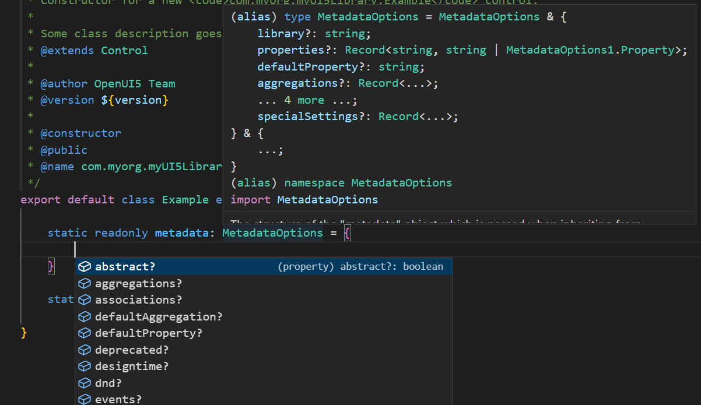

# Release Notes for the UI5 Type Definitions

This page provides information about changes in the UI5 type definitions. It does *not* mention any new UI5 APIs (they are covered by the general UI5 "[What's New](https://ui5.sap.com/#/topic/99ac68a5b1c3416ab5c84c99fefa250d)" and [Change Log](https://ui5.sap.com/#/releasenotes.html)), but focuses on **changes in how the JSDoc is parsed and turned into type definitions**. Some significant JSDoc changes done with the type definitions in mind are also contained.

The list is manually curated and not necessarily complete. Every release usually also contains several further JSDoc fixes which are meant to improve the type definitions.

Changes are grouped by UI5 version, as parser and generator changes so far only affect type definitions of later UI5 releases.

When doing control development also be aware of the [@ui5/ts-interface-generator change log](https://github.com/SAP/ui5-typescript/blob/main/packages/ts-interface-generator/CHANGELOG.md).


## 1.112 (March 2023)

* FEATURE: Not a feature of the type definitions per se, but still great news and hence mentioned here: the `babel-plugin-transform-modules-ui5`, which is used in the build pipeline for UI5 TypeScript apps has been [handed over to the UI5 community at GitHub](https://github.com/ui5-community/babel-plugin-transform-modules-ui5) by its creator [Ryan Murphy](https://github.com/r-murphy)! Having additional maintainers now enables the community to further evolve this important part of the pipeline.<br>
As also the publishing permissions have been handed over, continuity is ensured: the respective [npm package](https://www.npmjs.com/package/babel-preset-transform-ui5) can seamlessly continue to be used. The first new release 7.0.6 has already been published, enabling the feature explained below.<br>
Big thanks to Ryan!


* FEATURE: [Controller Extensions](https://ui5.sap.com/#/topic/21515f09c0324218bb705b27407f5d61) can now be specified as ES6 classes in TypeScript, making use of the newly renamed `overrides` block (was `override` before). So new it's not even documented yet anywhere else than here.
  ```ts
    export default class AppExtension extends ControllerExtension {
      static readonly overrides = {
        onInit: function() {
          // ...
        }
      }
    }
  ```
  > *Background:*  Controller Extensions could not be used in TypeScript so far when using ES6 classes - which is the recommended way of using UI5 in TypeScript. Such extensions may have an `override` definition containing methods like `onInit` which are to be overridden by the extension. Specifying this definition block as a static member of the class would lead to a name clash with the static method [ControllerExtension.override(...)](https://ui5.sap.com/#/api/sap.ui.core.mvc.ControllerExtension%23methods/sap.ui.core.mvc.ControllerExtension.override) in the base class `ControllerExtension`. Hence, `overrides` (plural) [is now offered as additional (and soon recommended) name](https://github.com/SAP/openui5/commit/167251ea3cfb98ce7b20a671810dd6814cdd70fe) for this definition block.<br>
Furthermore, specifying this block as static member did not work - regrdless of its name - because the [transformer](https://github.com/ui5-community/babel-plugin-transform-modules-ui5) would assign this block as static member to the transformed UI5 class instead of moving it **into** the definition block of `BaseClass.extend("ClassName", { ... })` where it is expected. The transformer [has been changed](https://github.com/ui5-community/babel-plugin-transform-modules-ui5/pull/82) to handle `overrides` in a special way - just like it already did with `metadata`.


## 1.111 (February 2023)

* BREAKING (FIX): some APIs had wrongly been generated in *two* places:<br>
  a) as named export of a library (or as a module on its own)<br>
  b) in the global namespace `sap.ui....`<br>
  The global usage has been disabled in 1.111, as the usage of globals is discouraged and prevents further optimization. In case you used it, switch to the explicit import.<br>
  Some examples:<br>
  ```ts
  import { browser } from "sap/ui/Device";
  const chromeVariant1 = browser.chrome; // OK: using the import from the line above is still fine
  const chromeVariant2 = sap.ui.Device.browser.chrome; // global access REMOVED in 1.111

  import { closeKeyboard, touch } from "sap/m/library";
  closeKeyboard(); // OK: using the import from the line above is still fine
  sap.m.closeKeyboard(); // global access REMOVED in 1.111

  touch.countContained(...); // OK: using the import from further above is still fine
  sap.m.touch.countContained(...); // global access REMOVED in 1.111
  ```
  List of affected APIs (removed globals):
  * `sap.ui.Device.browser` ->   `import { browser } from "sap/ui/Device"`
  * `sap.ui.Device.media`
  * `sap.ui.Device.orientation`
  * `sap.ui.Device.os`
  * `sap.ui.Device.resize`
  * `sap.ui.Device.support`
  * `sap.ui.Device.system`
  * `sap.ui.core.CustomStyleClassSupport()`
  * `sap.ui.model.odata.ODataTreeBindingAdapter()` -> import from `sap/ui/model/odata/ODataTreeBindingAdapter`
  * `sap.ui.model.odata.ODataTreeBindingFlat()`
  * `sap.ui.ux3.ShellPersonalization` -> import from `sap/ui/ux3/ShellPersonalization` 
  * `sap.m.closeKeyboard()` ->  `import { closeKeyboard } from "sap/m/library"`
  * `sap.m.getInvalidDate()`
  * `sap.m.getIScroll()`
  * `sap.m.getLocale()`
  * `sap.m.getLocaleData()`
  * `sap.m.getScrollDelegate()`
  * `sap.m.isDate()`
  * `sap.m.touch.countContained()`
  * `sap.m.touch.find()`
  * `sap.apf.constants` -> `import { constants } from "sap/apf/library"`
  * `sap.ca.ui.model.format.FormattingLibrary` -> import from `sap/ca/ui/model/format/FormattingLibrary`
  * `sap.chart.api.getChartTypeLayout()` -> `import { api } from "sap/chart/library"`
  * `sap.chart.api.getChartTypes()`
  * `sap.gantt.simple.*` -> import from `sap/gantt/library`
  * `sap.gantt.config.*`
  * `sap.gantt.palette.*`
  * `sap.ushell.services.ContentExtensionAdapterFactory` -> import from `sap/ushell/services/ContentExtensionAdapterFactory"`
  * `sap.ui.vk.getCore()` -> `import { getCore } from "sap/ui/vk/library"`
  * `sap.ui.vtm.AXIS1X` etc. -> `import { AXIS1X } from sap/ui/vtm/library`


* BREAKING (FIX): three modules had wrongly been a named export of another module when they are actually a module on their own. They were moved to the correct place.<br>
  ```ts
  // previously
  import { CustomStyleClassSupport } from "sap/ui/core/library";
  import { FileUploaderHttpRequestMethod } from "sap/ui/unified/library";
  import { model } from "sap/ca/ui/library";
  const FormattingLibrary = model.format.FormattingLibrary;

  // from 1.111
  import CustomStyleClassSupport from "sap/ui/core/CustomStyleClassSupport";
  import FileUploaderHttpRequestMethod from "sap/ui/unified/FileUploaderHttpRequestMethod";
  import FormattingLibrary from "sap/ca/ui/model/format/FormattingLibrary";
  ```

* BREAKING (FIX): some constants in the `simple.exportTableCustomDataType` object of the `sap.gantt` library had wrong names generated, which are now corrected:
  * `Boolean1` -> `Boolean`
  * `Date1` -> `Date`
  * `String1` -> `String`


## 1.110 (January 25th 2023)

* FEATURE: the `metadata` object specified when defining a new control (or other ManagedObject) has now been formally typed in [sap.ui.core.Element.MetadataOptions](https://sdk.openui5.org/1.110.0/#/api/sap.ui.core.Element.MetadataOptions) and related types.<br>
This not only helps with [issues when inheriting from TypeScript-developed controls](https://github.com/SAP/ui5-typescript/issues/338), but also gives type safety and code completion for those metadata objects:<br>


* FEATURE: there are now type definitions published describing the UI5 manifest structure. The manifest has its own versioning and repository and is not really relevant for the runtime APIs of UI5, but this news might still be interesting for TypeScript users.<br>
These types can be found [in the manifest's GitHub repository](https://github.com/SAP/ui5-manifest/blob/master/types/manifest.d.ts) as well as in the [@ui5/manifest](https://www.npmjs.com/package/@ui5/manifest) npm package.


## 1.109 (end of November 2022)

no news


## 1.108 (November 2022)

* FEATURE: the JSDoc parser and dts-generator have been improved to support optional properties and nullable map entries. Examples:
  ```
  @param {{width: number, height=: number}} dimensions - height is optional
  ```
  in JSDoc ends up in the *.d.ts file as:
  ```ts
  dimensions: {width: number; height?: number;}
  ```
  And
  ```
  @param {Object<string,string?>} someMap - with nullable entries
  ```
  in JSDoc ends up in the *.d.ts file as:
  ```ts
  someMap: Record<string, string | null>
  ```
  There are not many occurrences of this yet (one is [`FacetFilterList.getSelectedKeys(...)`](https://sdk.openui5.org/api/sap.m.FacetFilterList#methods/getSelectedKeys)), but this feature can now be used in the ongoing improvements of the UI5 JSDoc.

## 1.107 (October 2022)

no news

## 1.106 (September 2022)

* FIX: The JSDoc for [100+ UI5 APIs in sap.ui.core](https://github.com/SAP/openui5/commit/5c24494c5ca88a77904cd8d921937ad530a21475) and [~20 more in other libraries](https://github.com/SAP/openui5/commit/f066ae92beed86211d1f547ab5fb08f1eae1aec6) has been fixed to potentially return `undefined`/`null`. Furthermore, [a fix in the central generation of accessor methods](https://github.com/SAP/openui5/commit/e205887bd0cd5df90ca2a9d8c85ede533967d12f) has done the same (they can also return `null`) for dozens of named `removeAssociation` calls like `removeAriaDescribedBy`.<br>
If you are using `strictNullChecks=true`, you now have to verify that the result of these methods is not nullish before using it. So this change is *potentially breaking* (see the first bullet point for the 1.105 release below for details and an example).

* FIX: 20-30 API documentations, in particular return types, [have been fixed or improved with a more detailed structure description](https://github.com/SAP/openui5/commit/7f29468a4d06897c70c0e7bb810a7d5d77882f12) to ease their usage with TypeScript.


## 1.105 (August 2022)

* BREAKING: *potentially* breaking *when using strictNullChecks=true* are the JSDoc fixes mentioned below, which add `undefined` to the returned types of some APIs:<br>
E.g. in case you have been using `this.getView().doSomething(...)` in a controller, TypeScript will show an error after updating to the 1.105 types, saying that `getView()` might return "undefined" and you cannot use the result without checking first.<br>
A possible solution is to change the code like this
  ```ts
  const view = this.getView();
  if (view) {
    view.doSomething();
  }
  ```
  This seems tedious, as in "normal" controllers, when "properly" set up with a view, always the actual view will be returned - never "undefined". But the point of the "strictNullChecks" option of TypeScript is to protect from running into an issue at runtime where an object is not defined. This protection can only work when every posible "undefined" value is properly documented.

* FEATURE: the JSDoc parser plugin has been [enhanced](https://github.com/SAP/openui5/commit/dae14be1a2b7ad7a4dbe4b084ba925328ca3da5e) to no longer collapse all object structure descriptions into the type "object", but to preserve the structure, so it gets part of the type definitions.<br>
This means the type information about return structures can now be more detailed than with the JSDoc default behavior. This has an immediate positive effect on those APIs which already had precise descriptions and allows further upcoming improvements (e.g. the return type fix mentioned two bullet points below).

* FIX: The JSDoc for some central UI5 APIs [has been fixed](https://github.com/SAP/openui5/commit/78e6c31c36068a62de7df591b8d2c10d925445c7) to potentially return `undefined`. (Implementation-wise there was no change - `undefined` was returned in certain circumstances before - and the fulltext documentation already mentioned it, but the type definitions did not.)<br>
If you are using [`strictNullChecks=true`](https://www.typescriptlang.org/tsconfig/#strictNullChecks), you now have to verify that the result of these methods is not nullish before using it. So this change is *potentially breaking* (see the first item above). The affected methods are:
  * `sap/ui/core/mvc/Controller.getView()`
  * `sap/ui/core/mvc/Controller.byId()`
  * `sap/ui/core/mvc/Controller.getOwnerComponent()`
  * `sap/ui/core/mvc/View.byId()`
  * `sap/ui/core/mvc/View.getLocalId()`
  * `sap/ui/core/routing/Router.getRoute()`

* FIX: Dozens of API documentations, in particular return types, [have been fixed or improved with a more detailed structure description](https://github.com/SAP/openui5/commit/a43178b8980b00b5c198d0640864f639de3f60b6) to ease their usage with TypeScript.


## 1.104 (July 2022)

no news

## 1.103 (June 2022)

* INTERNAL: set the minimum TypeScript version for dtslint checks to 4.3

## 1.102 (May 2022)

* FEATURE: Allow binding strings for properties and aggregations.<br>
This has a huge impact on the type definitions across all of UI5: before this change the types did not allow binding strings like `{count}` in `new MyControl({count: "{count}"})` for non-string properties.

## 1.101 (April 2022)

no news

## 1.100 (March 2022)

* FEATURE: add jQuery and qUnit definitions to the ts-type-esm packages (also THREE.js for SAPUI5), so they no longer need to be added as dependency in applications.
* FEATURE: type parser: allow variant types in more places without wrapping them in parentheses
* FIX: type parser: don't accept function signatures where a comma is missing
* FIX: type parser: don't accept generic types w/o type parameters
* FIX: several return structure fixes (incl. [this one](https://github.com/SAP/openui5/commit/0ae83355922042fccc4a001cff0402b42126e780)) in preparation for the "object structure" feature, which was finally enabled for 1.105.

## 1.99 (February 2022)

* FEATURE: generator updated to use `strictNullChecks=true` - including the changes to allow that
* FEATURE: generator updated to use `strictPropertyInitialization=true` - including the changes to allow that
* FIX: no longer remove the full-text documentation for return types in the type definitions
* FIX: permutations for optional parameters fixed in generator
* INTERNAL: internally enabled dtslint checks for the types resulting from any UI5 code change
* INTERNAL: enable type error checks for the so-far-excluded sap.fe library 
