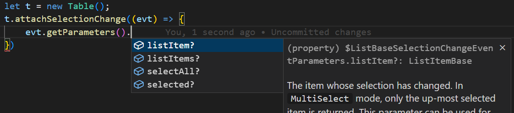

# Release Notes for the UI5 Type Definitions

This page provides information about changes in the UI5 type definitions and other news regarding TypeScript and UI5. It does *not* mention any new UI5 APIs (they are covered by the general UI5 "[What's New](https://ui5.sap.com/#/topic/99ac68a5b1c3416ab5c84c99fefa250d)" and [Change Log](https://ui5.sap.com/#/releasenotes.html)), but focuses on **changes in how the JSDoc is parsed and turned into type definitions**. Some significant JSDoc changes done with the type definitions in mind are also contained.

The list is manually curated and not necessarily complete. Every release usually also contains several further JSDoc fixes which are meant to improve the type definitions.

Changes are grouped by UI5 version, as parser and generator changes so far only affect type definitions of later UI5 releases. News that are independent from the UI5 or generator code are added to the release that appeared at the same time.

When doing control development also be aware of the [@ui5/ts-interface-generator change log](https://github.com/SAP/ui5-typescript/blob/main/packages/ts-interface-generator/CHANGELOG.md).

## 1.127.0 (August 2024)
- FEATURE/FIX: Controller extension support is now complete. This in particular concerns using pre-defined controller extensions like `sap/fe/core/controllerextensions/Routing` in your own controllers to add functionality. They can be used as-is or be partly overridded/enhanced using their static `override` method. A dummy method `ControllerExtension.use(...)` has been introduced in the type definitions for this. To make it work, also a new upcoming version >= 7.5.0 of [`babel-plugin-transform-modules-ui5`](https://www.npmjs.com/package/babel-plugin-transform-modules-ui5) (or a respective new version of [`ui5-tooling-transpile`](https://www.npmjs.com/package/ui5-tooling-transpile) embedding it as dependency) is required. See [the documentation](https://github.com/ui5-community/babel-plugin-transform-modules-ui5?tab=readme-ov-file#properties-related-to-controller-extensions) for details once the new release of babel-plugin-transform-modules-ui5 is published. This might get downported also to later patches of 1.120, 1.124 and 1.126, but not to the out-of-maintenance versions in between.
- FIX: abstract methods in base classes are now marked as optional in the type definitions.

## 1.126.0 (July 2024)
- BREAKING: some APIs in UI5 are marked as `restricted`, which means they are like `private`, but permitted to be used by specific target groups. From TypeScript perspective, they are considered `private`, which means they are not contained in the type definitions. In some cases, the `restricted` flag had not been considered before. Now it is, which means that some APIs are now removed from the type definitions. In particular, this is the case for properties (and events) declared in the metadata, so the respective `set...` and `get...` functions (or `fire...`,  `attach...` and `detach...`) are now removed from the types.
One example is `sap.m.ComboBoxBase.setOpen()` and `sap.m.ComboBoxBase.getOpen()`. They had been marked as "deprecated" and also "private" before, though, so the using them was not a good idea, anyway. Other examples are `sap.m.GenericTile.dropAreaOffset`, `sap.m.TabContainerItem.itemPropertyChanged`, `sap.ui.model.Binding.refresh` and `sap.ui.core.hyphenation.Hyphenation` (the only instances of this removal in the sap.ui.core library).
Still, this change can be breaking your build (not the runtime), but we reserve the right to do such fixes which have this effect. In case of issues, you can continue using older types or define the missing methods on your side.

## 1.125.0 (June 2024)
- No news

## 1.124.0 (May 2024)
- No news; these types are the first ones that were released using the updated publicly available npm package.

## 1.123.0 (April 2024)
- FEATURE: Documentation is now generated for all the Settings/Event/Eventparameter types (those with a `$` in their name). This allows carrying over deprecation info from the actual class which they belong to.
- RELATED: the new major [version 3 of the @ui5/dts-generator](https://www.npmjs.com/package/@ui5/dts-generator) has been published on npm 🎉. Finally, the same tool that creates the UI5 type definitions can be used for any UI5 library written in JavaScript! Also the updated sources of this updated dts-generator are now [available on GitHub](https://github.com/SAP/ui5-typescript/tree/main/packages/dts-generator). See [this general documentation](https://github.com/SAP/ui5-typescript/tree/main/packages/dts-generator) or dive right into [this step-by-step end-to-end tutorial](https://github.com/SAP/ui5-typescript/blob/main/packages/dts-generator/end-to-end-sample.md) that demonstrates its usage.

## 1.122.0 (March 2024)
- No news

## 1.121.0 (February 2024)
- FEATURE: `abstract` classes are now supported (UI5 classes marked as “abstract” are now also marked as such in the type definitions).
- FEATURE: constructors hidden in UI5 via `@hideconstructor` are now `protected` in the type definitions.
- RELATED: the huge and popular "Walkthrough" tutorial of UI5 is now available in a new and updated [TypeScript version](https://github.com/SAP-samples/ui5-typescript-walkthrough/)
- ISSUE: Due to a glitch with the DefinitelyTyped release, the `@types/openui5` package was not released for this version. Instead the content was released as version 1.120.3. This issue does not affect the `@openui5/types` and `@sapui5/types` packages which we release ourselves. The [attempt to enforce a 1.121.0 release](https://github.com/DefinitelyTyped/DefinitelyTyped/commit/ffd45c5522753f13c1fd3b221846b92b4ea8769a) failed.

## 1.120.0 (November 2023)
- FEATURE: The `$...Settings` types (the structures describing what data can be passed into constructors) now also contain the "specialSettings" (non-bindable data for initialization, like the id, objectBindings, bindingContexts, and the componentData for Components).
- FIX: Interfaces representing static objects from namespaces support inheritance now. This was done for (and mainly affects) the Delegates in the sap.ui.mdc library.
- ISSUE: There are some glitches in the `@types/openui5` package released via DefinitelyTyped. These glitches do not affect the `@openui5/types` and `@sapui5/types` packages which we release ourselves.
  - Version 1.120.0 are the true 1.120 types as intended by us
  - Version 1.120.1 was released due to a [commit by DefinitelyTyped staff](https://github.com/DefinitelyTyped/DefinitelyTyped/commit/cefea686428358cdffe2211406d411fe9f3b0bb5), but without any change of content.
  - Version 1.120.2 was also released due to a [commit by DefinitelyTyped staff](https://github.com/DefinitelyTyped/DefinitelyTyped/commit/958ebc6a272d19ae5242d7d04077fed841117963), but without any change of content.
  - Version 1.120.3 accidentally contains the 1.121.0 content. However, it contains only minimal actual changes but lots of improvements regarding @since, @deprecated and @abstract, hence we did not override it with yet another 1.120 version.

## 1.119.0 (October 2023)

- BUG: for the `@types/openui5` package, the 1.120.0 types have accidentally been published as 1.119.3 (we missed adapting to a change in DefinitelyTyped, then our automated process caused this because it did not update the version number in the newly added `package.json` file). As result, `@types/openui5` 1.119.3 contains APIs which are only available since UI5 1.120. If this is a problem, use 1.119.2 instead. `@sapui5/types` and `@openui5/types` are not affected.
- FIX: The technically accurate description of this fix in the types generator would be: functions/properties on namespaces without "export" are now always declared as member of the namespace when they have a different "module" than the namespace itself. In practice - and easier to understand - this means: the `sap.ushell.bootstrap(...)` function gets available in the type definitions.

## 1.118.0 (September 2023)

- RELATED: The [`ts-interface-generator`](https://www.npmjs.com/package/@ui5/ts-interface-generator) for control development in TS is now triggered by [`ui5-tooling-transpile`](https://www.npmjs.com/package/ui5-tooling-transpile): this means that you no longer need to run the interface generator explicitly, it simply runs automatically as soon as the project has a dependency to it.<br> 
This suggestion came up in our TypeScript workshop at UI5con in July - and it's already implemented!

## 1.117.0 (August 2023)

- FEATURE: the `getSource()` method of events no longer returns the base type `EventProvider`, but the specific type on which this event was defined. This makes the usage easier in many cases by avoiding additional type casts. But note: the event might be defined on a superclass of the control on which you register the event handler. In this case the returned type is this superclass. Example:
  ```ts
  handlePress: function(event: Button$PressEvent) {
    const source = event.getSource();
    // "source" is automatically typed as sap.m.Button now, not as sap.ui.base.EventProvider. Nice!
  }

  // Beware:
  handleChange: function(event: InputBase$ChangeEvent) {
    const source = event.getSource();
    // Even when the event source is a sap.m.Input control,
    // "source" is still typed as its superclass sap.m.InputBase, not sap.m.Input,
    // because this is the type on which the event was introduced.
    // The same is the case for the name of the event type, this
    // should help and at least makes the behavior consistent.
  }
  ```


- FIX: for few (about a dozen) events the typing of the event parameters had been missing, this is now fixed. This issue affected events in ODataModel v4 related classes: `ODataModel` (e.g. `dataReceived`),  `ODataListBinding` (e.g. `createCompleted`),  `ODataPropertyBinding` and `ODataContextBinding`. 


## 1.116.0 (July 2023)

Starting with this version, the UI5 type definitions are no longer in "experimental beta" state but recommended for general usage.

We encourage you to use UI5 with TypeScript for an improved development efficiency and experience. TypeScript itself keeps evolving and we try to further improve the UI5 type definitions, so there could be potential incompatible changes between versions of the type definitions. However, such incompatibilities would only affect the compilation of your code but will not cause runtime issues in your application. Plus, there are various ways to easily deal with them: you can, for example, simply keep using the previous version of the UI5 type definitions together with an updated UI5 runtime.<br>
To keep track of any significant changes, observe the Release Notes on this page.

- RELATED: a [video "UI5 TypeScript Tutorial"](https://www.youtube.com/watch?v=CRKNIiXZN6U) has been published with the current, updated state of the [ui5-typescript-tutorial](https://github.com/SAP-samples/ui5-typescript-tutorial) repository.

## 1.115.1 - changes on top of those listed below for 1.115.0 (June 2023)

We are providing an extraordinary v1.115.1 patch for the type definitions ([@types/openui5](https://www.npmjs.com/package/@types/openui5/v/1.115.1) on June 21st, @sapui5/types and @openui5/types the following week) with further improvements and with bugfixes. (For the latter packages we *always* release patches, but usually without any significant changes and for @types/openui5 we usually do not release any patches, hence "extraordinary".)

* **SOON INCOMPATIBLE** CHANGE: the names of the new types for event parameters have changed from `$<ControlName><EventName>EventParameters` to `<ControlName>$<EventName>EventParameters` to avoid name clashes. Version 1.115.1 and further 1.115.x patches support BOTH names, but version 1.116 and higher will only support the new names.

* FEATURE: in addition to the types for event parameter objects, there are now also types for the events themselves. If you want to type e.g. an method parameter in an event handler, you no longer need to write it as Event with generics like `Event<InputBase$ChangeEventParameters>`, but you can simply use the event type `InputBase$ChangeEvent`.

* FIX: several export-related problems caused by a change in 1.115.0 are fixed (e.g. often encountered with `URLHelper` from `sap/m/library` and `sap/m/DynamicDateUtil`). If you have problems with unavailable types, use 1.115.1 first, but also have a look at the intentional changes in 1.115.0 described below!

* RELATED: Starting with version 0.7.0 released around the same time, the `@ui5/ts-interface-generator` supporting control development does also generate types for the events declared by the controls.


## 1.115.0 - also see the separate section on 1.115.1 above! (June 2023)

**NOTE: 1.115.0 had some issues with certain types no longer being exported (on top of the intentional changes described below), hence 1.115.1 with these issues fixed - and further improvements - is being published soon after.**

* **INCOMPATIBLE** FIX: the properties of `sap/ui/Device` can now be used in the expected way - and *only* in this way:
  ```ts
  import Device from "sap/ui/Device";
  const isMobile = Device.browser.mobile;
  ```
  Or, as a dynamic import:
  ```ts
  const Device = (await import("sap/ui/Device")).default;
  const isMobile = Device.browser.mobile;
  ```
  The previous workaround (importing the named export `browser` like `import { browser } from "sap/ui/Device";`) **does no longer work**. Please switch to using properties on the default export, as shown above.

* **INCOMPATIBLE**: Enums and static properties are now properties of the module's default export (before this change they were named exports of the module). This change requires **adaptation in application code where such entities are imported**. Example:

  Before this change `Action`, `Dock` and `registry` were named exports:
  ```ts
  import MessageBox, { Action } from "sap/m/MessageBox";
  import { Dock } from "sap/ui/core/Popup";
  import { registry } from "sap/ui/core/Element";

  let a: Action = Action.ABORT;
  let d: Dock = Dock.BeginBottom;
  registry.get("myElem");

  // dynamic import:
  let Action = (await import("sap/m/MessageBox")).Action;
  let x = Action.ABORT;
  ```
  Starting with version 1.115, such code will cause errors looking like this:<br>
  
  
  However, the fix is simple: now they are accessible as static properties on the respective main object. Import only the default exports like `MessageBox`, `Popup` and `Element` and access `Action`, `Dock`, `registry` and other enums and static properties from there:

  ```ts
  import MessageBox from "sap/m/MessageBox";
  import Popup from "sap/ui/core/Popup";
  import Element from "sap/ui/core/Element";

  let a = MessageBox.Action.ABORT;
  let d = Popup.Dock.BeginBottom;
  Element.registry.get("myElem");

  // dynamic import:
  let MessageBox = (await import("sap/m/MessageBox")).default;
  let x = MessageBox.Action.ABORT;
  ```

  However, note that pure *types* still remain named exports. So do enums etc. defined directly within a library (not in a contained control etc., but in the library module).

* (potentially INCOMPATIBLE) FEATURE: event parameters are now fully typed. Earlier, when a control event was handled, any string could be used to access an event parameter (regardless of whether a parameter with this name actually existed) and the returned type was `any`. Now you get all the code completion and type check goodies for all the Event-related APIs:<br>
<br>


  This change is incompatible for existing application code where event parameters are accessed on an object typed as "sap/ui/base/Event":
  ```ts
  import Event from "sap/ui/base/Event";

  const myControl = new SomeUI5Control({
    someEvent: (evt: Event) => {
        const parameterValue = evt.getParameter("eventParamName");
  ```
  Because the base class "Event" has no specific parameters, there will now be the following error for the string:
  ```
  Argument of type 'string' is not assignable to parameter of type 'never'.ts(2345)
  ```
  The solution is to simply remove the type assignment from `evt` - it happens automatically now, with the event's specific parameters!
  ```ts
  const myControl = new SomeUI5Control({
    someEvent: (evt) => {
        const parameterValue = evt.getParameter("eventParamName");
  ```
  However, this only works for places where the type of `evt` can be automatically determined, like in constructors (as above) or in `attachXYEvent(...)` calls. In other places, like controller methods which are assigned as handlers in XMLViews, the type of the event needs to be explicitly specified. As of version 1.115.0, this works by using Generics, giving the event parameter type to the Event class (in version 1.115.1 and higher there are also types for the events themselves):
  ```ts
  import Event from "sap/ui/base/Event";

  public handleChange(evt: Event<$InputBaseChangeEventParameters>) : void {
      ...
  }
  ```
  In later versions, starting from 1.116.0, the parameter type names change slightly (`InputBase$ChangeEventParameters`) and also types for the events are provided since 1.115.1 (like `InputBase$ChangeEvent`).

* RELATED: Starting with version 0.6.0, the `@ui5/ts-interface-generator` supporting control development does also add JSDoc to the generated methods (generic documentation as well as taken from the original control metadata section).


## 1.114 (May 2023)

No news (but of course several rounds of improvements within the UI5 API definitions, giving more details for previously too-vague types like `object`, `function` or `Promise`).

## 1.113 (April 2023)

* RELATED: New names for the type packages!<br>
  Starting with the 1.113 release in April, use:<br>
  * `@openui5/types` instead of `@openui5/ts-types-esm`
  * `@sapui5/types` instead of `@sapui5/ts-types-esm`

  The old packages are then deprecated and will only continue to be updated for a few months.

* FIX(?): APIs which are `@protected` (i.e. shall not be used by applications, only by related framework classes and controls) are now marked as such in the TypeScript documentation.

* FIX(?): the types in the existing OPA-related APIs have been greatly improved (in [this](https://github.com/SAP/openui5/commit/30648677b8d4d40454e439182726c1a2c6891a1f) and [this](https://github.com/SAP/openui5/commit/19d7c7f6cd5ef24fcac625f94a92fba7d82bed73) change). This is a big first step in making OPA usage in TypeScript easier.

* RELATED: a *WORK-IN-PROGRESS* sample project demonstrating how to write tests (QUnit and OPA) has been published in the `testing` branch at https://github.com/SAP-samples/ui5-typescript-helloworld/tree/testing. NOTE: this is *experimental* and we are still working on improving the APIs and types especially around OPA! It works, but final testing code will look different (and hopefully simpler).


## 1.112 (March 2023)

* FEATURE: The frequently used modules `sap/ui/thirdparty/jquery` and `sap/ui/thirdparty/qunit-2` are now declared, so they can be explicitly imported. As both are also available globally, they could just be used without importing so far, but it's cleaner to explicitly import them if needed. This is now possible.<br>
However, in case of QUnit, an error is raised when it is loaded a second time at runtime, so it may not be loaded before. To make it work, you would have to remove any direct `<script>` imports of QUnit and only load it through the UI5 module loader using `import` statements.<br>
Other modules from the "sap/ui/thirdparty" folder are not declared, because thirdparty libraries are not really part of the UI5 public API and the others are far less present *within* the UI5 API than jQuery and QUnit. But applications loading them can declare them easily inside separate *.d.ts files within the application, e.g. like:
  ```ts
  declare module "sap/ui/thirdparty/URI" {
    import * as URI from "urijs";
    export default URI;
  }
  ```

* RELATED: Not a feature of the type definitions per se, but still great news and hence mentioned here: the `babel-plugin-transform-modules-ui5`, which is used in the build pipeline for UI5 TypeScript apps has been [handed over to the UI5 community at GitHub](https://github.com/ui5-community/babel-plugin-transform-modules-ui5) by its creator [Ryan Murphy](https://github.com/r-murphy)! Having additional maintainers now enables the community to further evolve this important part of the pipeline.<br>
As also the publishing permissions have been handed over, continuity is ensured: the respective [npm package](https://www.npmjs.com/package/babel-preset-transform-ui5) can seamlessly continue to be used. The first new release 7.0.6 has already been published, enabling the feature explained below.<br>
Big thanks to Ryan!


* <span id="overrides">FEATURE</span>: [Controller Extensions](https://ui5.sap.com/#/topic/21515f09c0324218bb705b27407f5d61) can now be specified as ES6 classes in TypeScript, making use of the newly renamed `overrides` block (was `override` before). So new it's not even documented yet anywhere else than here.
  ```ts
    export default class AppExtension extends ControllerExtension {
      static readonly overrides = {
        onInit: function() {
          // ...
        }
      }
    }
  ```
  > *Background:*  Controller Extensions could not be used in TypeScript so far when using ES6 classes - which is the recommended way of using UI5 in TypeScript. Such extensions may have an `override` definition containing methods like `onInit` which are to be overridden by the extension. Specifying this definition block as a static member of the class would lead to a name clash with the static method [ControllerExtension.override(...)](https://ui5.sap.com/#/api/sap.ui.core.mvc.ControllerExtension%23methods/sap.ui.core.mvc.ControllerExtension.override) in the base class `ControllerExtension`. Hence, `overrides` (plural) [is now offered as additional (and soon recommended) name](https://github.com/SAP/openui5/commit/167251ea3cfb98ce7b20a671810dd6814cdd70fe) for this definition block.<br>
Furthermore, specifying this block as static member did not work - regardless of its name - because the [transformer](https://github.com/ui5-community/babel-plugin-transform-modules-ui5) would assign this block as static member to the transformed UI5 class instead of moving it **into** the definition block of `BaseClass.extend("ClassName", { ... })` where it is expected. The transformer [has been changed](https://github.com/ui5-community/babel-plugin-transform-modules-ui5/pull/82) to handle `overrides` in a special way - just like it already did with `metadata`.

  > Note: the new plural form `overrides` is only recognized by the UI5 runtime version 1.112 and higher. But when the new [`overridesToOverride`](https://github.com/ui5-community/babel-plugin-transform-modules-ui5/pull/89) option is set, the transformer changes the new, non-conflicting plural form to the singular form also recognized by older UI5 runtime versions. 

* FEATURE: the `.isA(...)` method (on all UI5 objects and as static method on sap.ui.base.Object) has been enhanced with generics in a way that it is recognized by TS as type guard.<br>
This means when you have an object of any kind (e.g. a control requested with `.byId(...)`) and you write
  ```ts
  if (control.isA<ComboBox>("sap.m.ComboBox")) { ... }
  ```
  then inside the `if` body TypeScript *knows* it is a ComboBox. While this is more code than a plain cast, it actually also checks the type at runtime.<br>
  Unfortunately the class name has to be written twice, once for TypeScript and once for the UI5 runtime.<br>
  (more details [in the GitHub request](https://github.com/SAP/ui5-typescript/issues/387)).


## 1.111 (February 2023)

* BREAKING (FIX): some APIs had wrongly been generated in *two* places:<br>
  a) as named export of a library (or as a module on its own)<br>
  b) in the global namespace `sap.ui....`<br>
  The global usage has been disabled in 1.111, as the usage of globals is discouraged and prevents further optimization. In case you used it, switch to the explicit import.<br>
  Some examples:<br>
  ```ts
  import Device from "sap/ui/Device";
  const chromeVariant1 = Device.browser.chrome; // OK: proper way starting with 1.115

  import { browser } from "sap/ui/Device";
  const chromeVariant2 = browser.chrome; // using the named export was ok before and after 1.111, but was removed in 1.115

  const chromeVariant3 = sap.ui.Device.browser.chrome; // global access REMOVED in 1.111

  import { closeKeyboard, touch } from "sap/m/library";
  closeKeyboard(); // OK: using the import from the line above is still fine
  sap.m.closeKeyboard(); // global access REMOVED in 1.111

  touch.countContained(...); // OK: using the import from further above is still fine
  sap.m.touch.countContained(...); // global access REMOVED in 1.111
  ```
  List of affected APIs (removed globals):
  * `sap.ui.Device.browser` ->   `import Device from "sap/ui/Device"` (in versions up to 1.114 the named export `browser` was used)
  * `sap.ui.Device.media`
  * `sap.ui.Device.orientation`
  * `sap.ui.Device.os`
  * `sap.ui.Device.resize`
  * `sap.ui.Device.support`
  * `sap.ui.Device.system`
  * `sap.ui.core.CustomStyleClassSupport()`
  * `sap.ui.model.odata.ODataTreeBindingAdapter()` -> import from `sap/ui/model/odata/ODataTreeBindingAdapter`
  * `sap.ui.model.odata.ODataTreeBindingFlat()`
  * `sap.ui.ux3.ShellPersonalization` -> import from `sap/ui/ux3/ShellPersonalization` 
  * `sap.m.closeKeyboard()` ->  `import { closeKeyboard } from "sap/m/library"`
  * `sap.m.getInvalidDate()`
  * `sap.m.getIScroll()`
  * `sap.m.getLocale()`
  * `sap.m.getLocaleData()`
  * `sap.m.getScrollDelegate()`
  * `sap.m.isDate()`
  * `sap.m.touch.countContained()`
  * `sap.m.touch.find()`
  * `sap.apf.constants` -> `import { constants } from "sap/apf/library"`
  * `sap.ca.ui.model.format.FormattingLibrary` -> import from `sap/ca/ui/model/format/FormattingLibrary`
  * `sap.chart.api.getChartTypeLayout()` -> `import { api } from "sap/chart/library"`
  * `sap.chart.api.getChartTypes()`
  * `sap.gantt.simple.*` -> import from `sap/gantt/library`
  * `sap.gantt.config.*`
  * `sap.gantt.palette.*`
  * `sap.ushell.services.ContentExtensionAdapterFactory` -> import from `sap/ushell/services/ContentExtensionAdapterFactory"`
  * `sap.ui.vk.getCore()` -> `import { getCore } from "sap/ui/vk/library"`
  * `sap.ui.vtm.AXIS1X` etc. -> `import { AXIS1X } from sap/ui/vtm/library`


* BREAKING (FIX): three modules had wrongly been a named export of another module when they are actually a module on their own. They were moved to the correct place.<br>
  ```ts
  // previously
  import { CustomStyleClassSupport } from "sap/ui/core/library";
  import { FileUploaderHttpRequestMethod } from "sap/ui/unified/library";
  import { model } from "sap/ca/ui/library";
  const FormattingLibrary = model.format.FormattingLibrary;

  // from 1.111
  import CustomStyleClassSupport from "sap/ui/core/CustomStyleClassSupport";
  import FileUploaderHttpRequestMethod from "sap/ui/unified/FileUploaderHttpRequestMethod";
  import FormattingLibrary from "sap/ca/ui/model/format/FormattingLibrary";
  ```

* BREAKING (FIX): some constants in the `simple.exportTableCustomDataType` object of the `sap.gantt` library had wrong names generated, which are now corrected:
  * `Boolean1` -> `Boolean`
  * `Date1` -> `Date`
  * `String1` -> `String`


## 1.110 (January 25th 2023)

* FEATURE: the `metadata` object specified when defining a new control (or other ManagedObject) has now been formally typed in [sap.ui.core.Element.MetadataOptions](https://sdk.openui5.org/1.110.0/#/api/sap.ui.core.Element.MetadataOptions) and related types.<br>
This not only helps with [issues when inheriting from TypeScript-developed controls](https://github.com/SAP/ui5-typescript/issues/338), but also gives type safety and code completion for those metadata objects:<br>


* RELATED: there are now type definitions published describing the UI5 manifest structure. The manifest has its own versioning and repository and is not really relevant for the runtime APIs of UI5, but this news might still be interesting for TypeScript users.<br>
These types can be found [in the manifest's GitHub repository](https://github.com/SAP/ui5-manifest/blob/master/types/manifest.d.ts) as well as in the [@ui5/manifest](https://www.npmjs.com/package/@ui5/manifest) npm package.


## 1.109 (end of November 2022)

no news


## 1.108 (November 2022)

* FEATURE: the JSDoc parser and dts-generator have been improved to support optional properties and nullable map entries. Examples:<!--  -->
  ```
  @param {{width: number, height=: number}} dimensions - height is optional
  ```
  <!--  -->in JSDoc ends up in the *.d.ts file as:
  ```ts
  dimensions: {width: number; height?: number;}
  ```
  And
  ```
  @param {Object<string,string?>} someMap - with nullable entries
  ```
  in JSDoc ends up in the *.d.ts file as:
  ```ts
  someMap: Record<string, string | null>
  ```
  There are not many occurrences of this yet (one is [`FacetFilterList.getSelectedKeys(...)`](https://sdk.openui5.org/api/sap.m.FacetFilterList#methods/getSelectedKeys)), but this feature can now be used in the ongoing improvements of the UI5 JSDoc.

## 1.107 (October 2022)

no news

## 1.106 (September 2022)

* FIX: The JSDoc for [100+ UI5 APIs in sap.ui.core](https://github.com/SAP/openui5/commit/5c24494c5ca88a77904cd8d921937ad530a21475) and [~20 more in other libraries](https://github.com/SAP/openui5/commit/f066ae92beed86211d1f547ab5fb08f1eae1aec6) has been fixed to potentially return `undefined`/`null`. Furthermore, [a fix in the central generation of accessor methods](https://github.com/SAP/openui5/commit/e205887bd0cd5df90ca2a9d8c85ede533967d12f) has done the same (they can also return `null`) for dozens of named `removeAssociation` calls like `removeAriaDescribedBy`.<br>
If you are using `strictNullChecks=true`, you now have to verify that the result of these methods is not nullish before using it. So this change is *potentially breaking* (see the first bullet point for the 1.105 release below for details and an example).

* FIX: 20-30 API documentations, in particular return types, [have been fixed or improved with a more detailed structure description](https://github.com/SAP/openui5/commit/7f29468a4d06897c70c0e7bb810a7d5d77882f12) to ease their usage with TypeScript.


## 1.105 (August 2022)

* BREAKING: *potentially* breaking *when using strictNullChecks=true* are the JSDoc fixes mentioned below, which add `undefined` to the returned types of some APIs:<br>
E.g. in case you have been using `this.getView().doSomething(...)` in a controller, TypeScript will show an error after updating to the 1.105 types, saying that `getView()` might return "undefined" and you cannot use the result without checking first.<br>
A possible solution is to change the code like this
  ```ts
  const view = this.getView();
  if (view) {
    view.doSomething();
  }
  ```
  This seems tedious, as in "normal" controllers, when "properly" set up with a view, always the actual view will be returned - never "undefined". But the point of the "strictNullChecks" option of TypeScript is to protect from running into an issue at runtime where an object is not defined. This protection can only work when every posible "undefined" value is properly documented.

* FEATURE: the JSDoc parser plugin has been [enhanced](https://github.com/SAP/openui5/commit/dae14be1a2b7ad7a4dbe4b084ba925328ca3da5e) to no longer collapse all object structure descriptions into the type "object", but to preserve the structure, so it gets part of the type definitions.<br>
This means the type information about return structures can now be more detailed than with the JSDoc default behavior. This has an immediate positive effect on those APIs which already had precise descriptions and allows further upcoming improvements (e.g. the return type fix mentioned two bullet points below).

* FIX: The JSDoc for some central UI5 APIs [has been fixed](https://github.com/SAP/openui5/commit/78e6c31c36068a62de7df591b8d2c10d925445c7) to potentially return `undefined`. (Implementation-wise there was no change - `undefined` was returned in certain circumstances before - and the fulltext documentation already mentioned it, but the type definitions did not.)<br>
If you are using [`strictNullChecks=true`](https://www.typescriptlang.org/tsconfig/#strictNullChecks), you now have to verify that the result of these methods is not nullish before using it. So this change is *potentially breaking* (see the first item above). The affected methods are:
  * `sap/ui/core/mvc/Controller.getView()`
  * `sap/ui/core/mvc/Controller.byId()`
  * `sap/ui/core/mvc/Controller.getOwnerComponent()`
  * `sap/ui/core/mvc/View.byId()`
  * `sap/ui/core/mvc/View.getLocalId()`
  * `sap/ui/core/routing/Router.getRoute()`

* FIX: Dozens of API documentations, in particular return types, [have been fixed or improved with a more detailed structure description](https://github.com/SAP/openui5/commit/a43178b8980b00b5c198d0640864f639de3f60b6) to ease their usage with TypeScript.


## 1.104 (July 2022)

no news

## 1.103 (June 2022)

* INTERNAL: set the minimum TypeScript version for dtslint checks to 4.3

## 1.102 (May 2022)

* FEATURE: Allow binding strings for properties and aggregations.<br>
This has a huge impact on the type definitions across all of UI5: before this change the types did not allow binding strings like `{count}` in `new MyControl({count: "{count}"})` for non-string properties.

## 1.101 (April 2022)

no news

## 1.100 (March 2022)

* FEATURE: add jQuery and qUnit definitions to the ts-type-esm packages (also THREE.js for SAPUI5), so they no longer need to be added as dependency in applications.
* FEATURE: type parser: allow variant types in more places without wrapping them in parentheses
* FIX: type parser: don't accept function signatures where a comma is missing
* FIX: type parser: don't accept generic types w/o type parameters
* FIX: several return structure fixes (incl. [this one](https://github.com/SAP/openui5/commit/0ae83355922042fccc4a001cff0402b42126e780)) in preparation for the "object structure" feature, which was finally enabled for 1.105.

## 1.99 (February 2022)

* FEATURE: generator updated to use `strictNullChecks=true` - including the changes to allow that
* FEATURE: generator updated to use `strictPropertyInitialization=true` - including the changes to allow that
* FIX: no longer remove the full-text documentation for return types in the type definitions
* FIX: permutations for optional parameters fixed in generator
* INTERNAL: internally enabled dtslint checks for the types resulting from any UI5 code change
* INTERNAL: enable type error checks for the so-far-excluded sap.fe library 


# Legal Information & Privacy Statement

This site is hosted by [GitHub Pages](https://pages.github.com/). Please see the [GitHub Privacy Statement](https://docs.github.com/en/github/site-policy/github-privacy-statement) for any information how GitHub processes your personal data.

Please note the [SAP terms of use](https://www.sap.com/corporate/en/legal/terms-of-use.html).

[Legal Statement / Impressum](https://www.sap.com/about/legal/impressum.html)

[Trademark Notice](https://www.sap.com/corporate/en/legal/trademark.html#third-party-trademark-notices)

